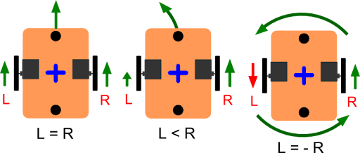
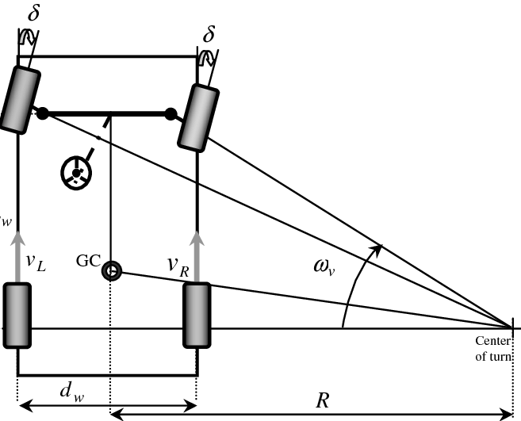
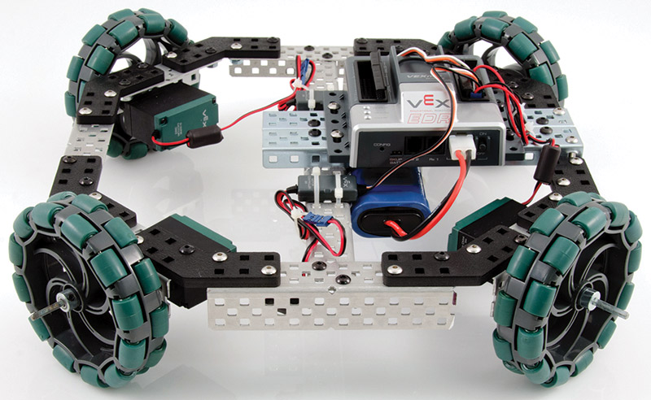

## Odometry(Odom) and Types of Drives in Mobile Robots

[Odometry](http://docs.ros.org/en/noetic/api/nav_msgs/html/msg/Odometry.html) and drive types are fundamental concepts in mobile robotics, playing a crucial role in a robot's ability to understand its position and movement within its environment.

**Odometry: Estimating a Robot's Pose**

Odometry is a technique for estimating the position (X, Y coordinates) and orientation (heading) of a mobile robot based on measurements from its wheels or other sensors. It's a relative positioning system, meaning it tracks the robot's displacement from a starting point.

**Components of Odometry:**

- **Sensors:** Rotary encoders attached to robot wheels are commonly used to measure wheel rotations. Other sensors like gyroscopes can contribute to orientation estimation.
- **Odometry Model:** Mathematical equations translate sensor data (e.g., wheel rotations) into robot displacement.(Its just math, that calculate the pose according to the drive of robot.)

**Importance of Odometry:**

- **Localization:** Odometry provides an initial estimate of the robot's position, which can be further refined using sensor fusion techniques like incorporating data from LiDAR or cameras.
- **Motion Planning and Control:** Robots rely on odometry data to plan their movements and control their drives for accurate navigation.

**Limitations of Odometry:**

- **Accumulating Errors:** Inaccuracies in wheel rotations or sensor measurements can lead to odometry drift over time.
- **Environmental Factors:** Uneven terrain, wheel slippage, or external forces can affect odometry accuracy.

**Types of Robot Drives**

The type of drive system a robot employs determines its movement capabilities and suitability for different tasks. Here are some common drive types:

1. **Differential Drive:**

   - **Description:** The most common type, featuring two independently driven wheels.
   - **Movement:**
      - Wheels move at the same speed and direction for forward motion.
      - Wheels move at different speeds or directions for turning.
   - **Advantages:** Simple, inexpensive, maneuverable.
   - **Disadvantages:** Differential steering can lead to inaccuracies, especially when turning on uneven terrain.
    

        
    

1. **Ackerman Steering (Car-like):**

   - **Description:** Similar to car steering, uses a single steering wheel to control the direction of two front wheels.
   - **Movement:** Front wheels turn at different angles for smoother turning.
   - **Advantages:** More stable and efficient for high-speed maneuvers.
   - **Disadvantages:** More complex mechanically compared to differential drive.
    

        
    

2. **Omni-Directional Drive (Mecanum Wheels):**

   - **Description:** Wheels with rollers angled at 45 degrees, allowing for movement in any direction.
   - **Movement:** Independent control of each wheel enables diagonal and rotational motions.
   - **Advantages:** Excellent maneuverability, ideal for precise positioning tasks.
   - **Disadvantages:** More complex design, potentially higher cost.

    

        
    

---
***TLTR***

Here are some great resources 

- [Youtube](https://www.youtube.com/watch?v=LrsTBWf6Wsc)
- [Youtube](https://www.youtube.com/watch?v=VLwCGTQmo9Q)

I have always got confused with difference between differential drive and skid steer: [Ans](https://www.reddit.com/r/robotics/comments/181uhqo/differential_steering_vs_skid_steering/)

--- 

If you want to learn more about all this and are up for the [challenge](https://www.cs.cmu.edu/~rasc/Download/AMRobots3.pdf) feel free to check this, it contains all the information that you need. **Warning** this is not at all needed for the tasks and will require great amount of time, so my advice is to check this out when you are done with the whole ROS specialization and are up for it.