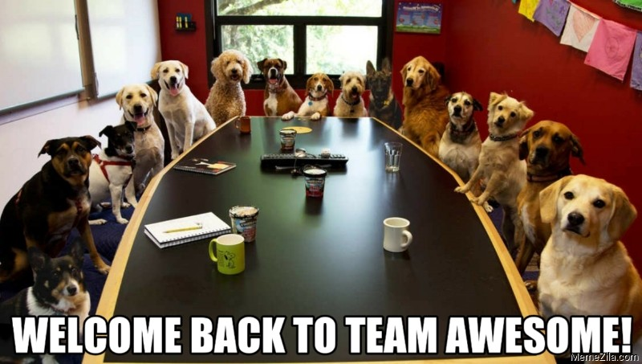

# ROS-Specialization-24

#### Kudos to you for choosing ROS Specialization.

    

Hope you guys enjoyed learning about ROS in [Summer Camp](https://github.com/Robotics-Club-IIT-BHU/Robotics-Camp-2024/tree/main).

Here we will dive deep in ROS and explore about some **TOOLS** and learn how to actually control and test your robot in **Simulation**

Topics that we will be covering in the specialization.....

- [TF and Frames](TF_and_Frames/TF_and_Frames.md) 
- [Pose](Pose/Pose.md)
- [Types of Drives and Odometry](Odom_and_Drive/Odom.md)
- [Rviz and Gazebo (including Gazebo Plugins)](Rviz_and_Gazebo/Rviz&Gazebo.md)
- [Robot Navigation (2D)](Mapping/mapping.md)
- Implementation in Simulation(Tasks)
  

### ***Happy Learning***