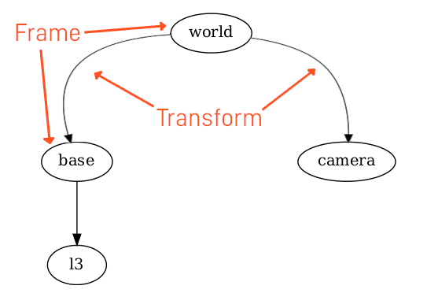
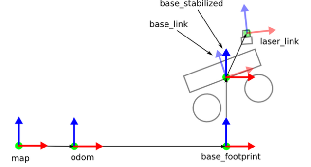
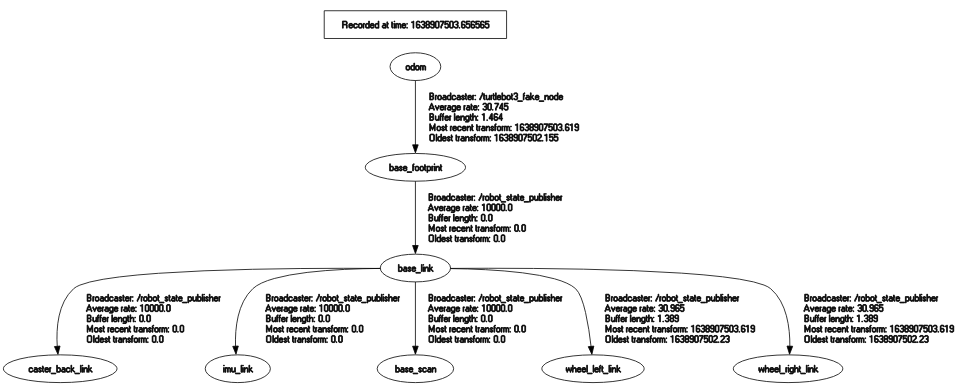

# Introduction to TF in ROS
---

    

## What are TFs?
---
TF (Transform) is a package in ROS (Robot Operating System) that lets the user keep track of multiple coordinate frames over time. The tf package maintains the relationship between coordinate frames in a tree structure, which makes it easy to transform points, vectors, etc. between any two frames at any desired point in time.

    

## Are TFs Needed?

A robotic system typically has many 3D coordinate frames that change over time, such as a world frame, base frame, gripper frame, head frame, etc. tf keeps track of all these frames over time, and allows you to ask questions like:

- Where was the head frame relative to the world frame, 5 seconds ago?
- What is the pose of the object in my gripper relative to my base?
- What is the current pose of the base frame in the map frame? 

tf can operate in a distributed system. This means all the information about the coordinate frames of a robot is available to all ROS components on any computer in the system. There is no central server of transform information. 

In robotics, especially in mobile robots and robotic arms, it is crucial to know the position and orientation of various parts of the robot and the environment. TFs allow for seamless transformations between different coordinate frames. This is essential for tasks such as:

- Mapping
- Navigation
- Object manipulation
- Sensor data integration

## TFs in Robotics?

TFs are used to transform data between coordinate frames. For example, if you have a sensor mounted on a robot, the data from this sensor needs to be transformed from the sensor's frame to the robot's frame to understand the sensor data in the context of the robot's position and orientation. Knowing where each link and joint of a robot is located helps in precise control and movement of the robot.

In a multi-agent environment, TFs are even more critical. They allow each robot to know the position and orientation of other robots in the environment. This information is vital for:

- Coordinated movements
- Collision avoidance
- Synchronized actions
- Efficient task distribution

By maintaining accurate and real-time transformations, robots can work synchronously and collaboratively, enhancing the overall efficiency and effectiveness of the robotic system.

    

## Importance of Frames

Frames are essential in robotics as they define the position and orientation of different parts of a robot, sensors, and the environment. The relationship between these frames is critical for understanding and interacting with the world. For instance:

- **Robot Base Frame**: Represents the robot's position in the world.
- **Sensor Frames**: Represents the position of sensors relative to the robot.
- **Map Frame**: Represents the global reference frame for navigation.

Understanding and managing these frames correctly is crucial for accurate perception, planning, and control in robotic systems.

###### Eg:- Simple TF Tree

In a simple robot setup, you might have the following frames:
- `map`: Global reference frame.
- `odom`: Odometry frame, relative to the map.
- `base_link`: Robot's base frame, relative to odom.
- `camera_link`: Camera's frame, relative to the robot base.

    

## Further Reading

For more detailed information, check out the following resources:
- [Understanding ROS TF(Vid)](https://www.youtube.com/watch?v=_t4HZ8r_qFM)
- [TF Overview](http://wiki.ros.org/tf)
- [TF Tutorials](http://wiki.ros.org/tf/Tutorials)

---

