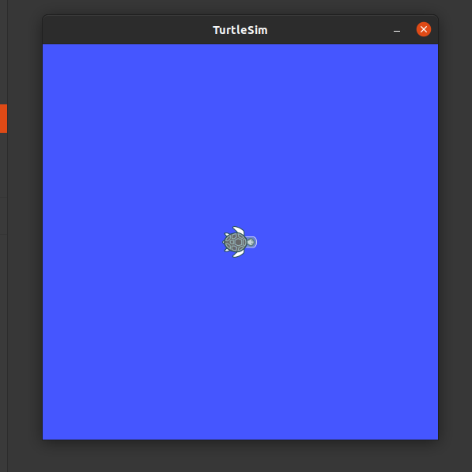

### Now that you have successfully installed ROS, lets run a basic package.

• For the official Guide, use [Official Guide for Turtlesim installation.](http://wiki.ros.org/turtlesim)

Install and start the turtlesim : 
```bash 
$ sudo apt-get install ros-noetic-turtlesim
```

Now run roscore 
```bash 
$ roscore
```

Open a new terminal and then run this cmd to launch turtlesim 
```bash 
$ rosrun turtlesim turtlesim_node
```
You should see a image like this



"rosrun" command is used to run a ros package.

Open a new terminal and run
```bash 
$ rosrun turtlesim turtle_teleop_key
```

If everything works fine you should be able to move your turtle

