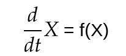
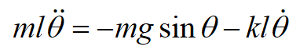
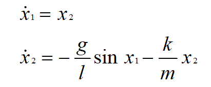
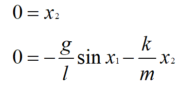
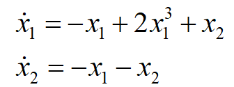
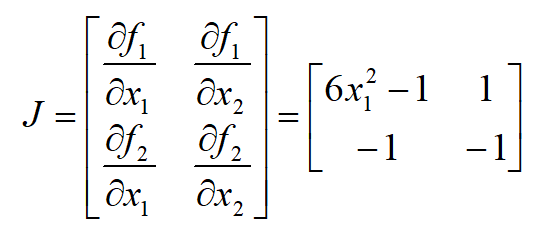
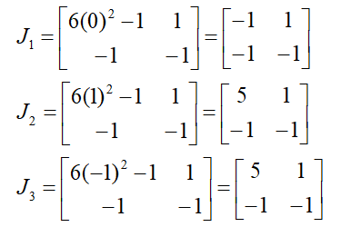
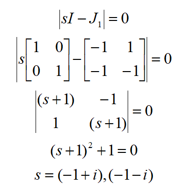

## What is Robot Control?
* In simple words, its the connection between **limbs(mechanics)** of the bot to its **brain(software)**.

* In technial terms - A system that can command, direct or regulate itself or another system to achieve a certain goal.

## Before diving in, here are some terms

* **System**: A combination or arrangement of a number of different physical components to form a whole unit such that that combining unit performs to achieve a certain goal.

* **Plant or process**: The part or component of a system that is required to be controlled.

* **Input**: It is the signal or excitation supplied to a control system.

* **Output**: It is the actual response obtained from the control system.

* **Disturbances**: The signal that has adverse effect on the performance of a control
system.

* Basically, there are two types of systems
    - Open loop systems
        - A control system in which the control action is totally independent of the output of the system.
        - Manually controlled systems are also categorised as open loop systems.
        - Such systems can been seen as in microwaves, washing machines etc, where we set the timer and that action takes place for that certain amount of time.
        
    

    
    

    <i>open loop control</i>
    
  

    - Closed loop Systems
        - A control system in which the control action adjusts itself according to the output generated to acheive a certain objective.

        - The difference between open loop system and closed loop system is the **feedback** closed loop system takes from the output.

        - The feedback gives an idea about the output which is then compared with the **desired action**. the deviation in output w.r.t to desired value is **error**. The controller tries to minimize this error.

        - Such systems can be seen all around us, some are present in electric irons, geysers to maintain a fixed temprature and many more!!

    

    
    

    <i>closed loop control</i>
    
 

### Feels complicated? 
Well, it'll be all worth it once you make your robots do this
- 

- or maybe even this -  
- 

### Phew!!! Now lets get into some real physics and maths

## Mathematical Modelling
This is the first step, which will walk us through the steps to derive dynamics equations of the system, analyzing the behavior of the system from the math and applying appropriate control strategy on the system to balance the system in an inherently unstable position.

### Modeling of non-linear Dynamical Systems
In mathematics and science, a non-linear system is a system in which the change of the output is not linearly proportional to the change of the input. Non-linear problems are of interest to engineers, biologists, mathematicians etc because most systems that occur in nature are inherently non-linear.
Non-linear dynamical systems that describe changes in variable over time may often appear chaotic, unpredictable or counter-intuitive in nature, contrasting with much simpler linear systems.

Typically the behavior of a non-linear system is described as a set of simultaneous equations in which the unknowns (or unknown functions in the case of differential equations) appear as variables of a polynomial of degree higher than one. Such a system is called a non-linear system of equations.

We will deal with dynamical systems that are modeled by a finite number of coupled first order ordinary differential equations

### Equations

$$
\dot{x}_1 = f_1(t, x_1, \ldots, x_n, u_1, \ldots, u_p)
$$
$$
\dot{x}_2 = f_2(t, x_1, \ldots, x_n, u_1, \ldots, u_p)
$$

$$
\vdots
$$

$$
\dot{x}_n = f_n(t, x_1, \ldots, x_n, u_1, \ldots, u_p)
$$

Here ẋ₁, ẋ₂,…ẋₙ denote the derivative of x₁, x₂…xₙ respectively with respect to time variable t and u₁, u₂,… uₚ etc are specified input variables. We call the variables x₁, x₂, …xₙ the state variables.

State Variables are used to to represent the memory the dynamical system has of its past or the desired variable of interest. We usually use vector notation to write these equations in a compact form.

#insert image

We can rewrite the n first-order differential equations as one n-dimensional first-order vector differential equation

$$
\dot{x} = f(t, x, u)
$$
#### Let's dive a bit deeper
## Linear systems

Linear systems are those whose states are governed by Linear differential equation below

Where, A is a **NxN square matrix** representing the dynamics of the system. And x is  the **Nx1 state vector** representing the current state of the system.

The state consists of the variables that are used to define the current state of affairs of the system. eg: For a robots, it may be its current position and velocity, then Matrix A will be representing the dynamics relating the derivatives of position and velocity to their current values.

### How to form equations for a system?

Well, only few systems follow Linear characterisitcs, few others can be approximated on some conditions.

We'll get to those, first we look at one simple linear system - the spring and mass system

<i>Brings back memories...eh?</i>

The state eqution for this system can be easily derived using Newton's Laws, but with increasing complexity of the system, use of Lagrangian is preffered as it gives the dynamics eqn with relative ease. Refer [here](https://youtu.be/KpLno70oYHE).

Either way we arrive at the eqn

Note that here x reperesnts the displacement of mass from the normal position.

Taking $ {x}$ and $\dot{x} $ to be our states, the above eqn can be written as -

 <i> Linear equation for spring mass system</i>

## What to do with non-linear systems?

Most Real world systems are quite complex making them hard to be represented in linear forms, so we use certain methods to model them like one.

Linear or non-linear, all systems have a relation between change of stte and current state, let a non-linear system be as follows (f(x) is any non-linear function)

Now, the non-linear system can be linearized about certain fixed states given as 

### Deriving the equations of motion for Non-Linear systems

The small example used for the linear system used simple mechanics and Newton's Laws of Motion. However for linearising a Non-Linear system we can go about two ways:

### i) NLM Method

Lets understant this whole process by solving the equations for a simple Pendulum

##insert bob figure

 <i> Fig 1</i>

Consider a simple pendulum shown in Fig 1, where <i>l</i> denotes the length of rod and <mi></i> denotes the mass of the bob. Assume the rod is rigid and has zero mass. Let <i>θ</i> denote the angle subtended by the rod and the vertical axis through the pivot point.

The pendulum is free to swing in the vertical plane, The bob of the pendulum moves in a circle of radius <i>l</i>. To write the equations of motion, let us identify the forces acting on the bob.

- Downward gravitational force mg where g is acceleration due to gravity.

- Frictional force resisting motion which can be assumed to be proportional to the speed of the bob with a coefficient of friction k.

Using the Newton’s second law of motion, the equation of motion for the bob in the tangential direction of motion can be written as

To obtain the State Equation for the pendulum, the state variables can be assumed as
$x_1 = \theta, \quad x_2 = \dot{\theta}$
The state equations for the pendulum model are:

It is possible to find the <b>equilibrium points</b> of this system by setting the <b>state derivatives</b> to zero and then solving for x1 and x2.

The equilibrium points are located at (nπ,0) for n = ±1,±2,… . From the physical descriptions of the pendulum, it is clear that there are only two equilibrium positions (0,0) and (π,0). The rest of equilibrium points are just repetitions based on number of full swings of the pendulum.

Hence this is how a simple physical system is modeled.

#### Stable and Unstable Equilibrium Points
A typical problem that arises while dealing with non-linear dynamical systems is to check if a system is stable or unstable at a given equilibrium point.

<b>Equilibrium</b> Point of a system is the point at which the state of the system doesn’t change. The equilibrium points can be estimated by setting ẋ₁=0 and ẋ₂ = 0 and solving the given equations for x₁ and x₂.

<b>Stable Equilibrium</b> - If a system always returns to the equilibrium point after small perturbations.

<b>Unstable Equilibrium</b> - If a system moves away from equilibrium point after small perturbations.

Consider the following set of coupled equations as given below.

We will discuss the steps in order to compute the stability of system.

1. Calculate the equilibrium points of the system by setting the values of ẋ₁ = ẋ₂ = 0.

    ​By solving the above two equations, the values of equilibrium point are :(0,0) , (-1,1) & (1,-1)
    
2. inearize the set of equations by calculating the Jacobian.
    Behavior of Non-linear systems is very hard to analyse. Linearization is a method which involves creating a linear approximation of a non-linear system that is valid in a small region around the operating point (in this case, the equilibrium points).

    In order to linearize a set of equations, we need to first calculate the Jacobian for a set of equations. You can read more about Jacobian [here](https://mathworld.wolfram.com/Jacobian.html)

    Consider the following:

    The Jacobian J for the set of equations can be calculated as:

3. Substitute the value of the equilibrium points in the matrix J to find 3 matrices J₁, J₂ and J₃.

4. Calculate the eigenvalues of each of the matrices.

    Eigen values of state matrices represent poles of a system. The poles decides the stability of a system and if the poles are on the negative half of the complex plane i.e. they have the negative real part then the system is stable and if the real part is positive the system is unstable. A system is marginally stable if it has simple poles (non repeated) on imaginary axis and unstable if it is repeated. Hence by intuition you can see that for simple pendulum case the pendulum in downward position is stable and in upright position it is unstable. Find the Jacobian around the two equilibrium points and verify the same.

    The eigenvalues can be calculated by constructing the characteristic equation of the matrix and equating it to zero.

    For equilibrium point (0,0) :-

 For equilibrium point (-1,1) and (1,-1):   

6. Check the real part of the eigenvalues calculated for each equilibrium points.

    For each Equilibrium point

    ● If all the eigenvalues have negative real part, the system is Stable at the given Equilibrium point.

    ● If even one of the eigenvalues has positive real part, the system is Unstable at the given Equilibrium point.

    ​ For Equilibrium Point (0,0), the eigenvalues are (-1-i) and (-1+i). Since both eigenvalues have negative real part, the system is Stable.

    ​ For Equilibrium Points (1,-1) and (-1,1), the eigenvalues are (2+2√2) and (2-2√2). Since one of the eigenvalues has a positive real part, the system is Unstable.

###  Euler-Lagrange method 
