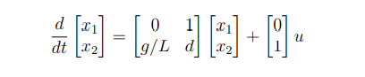
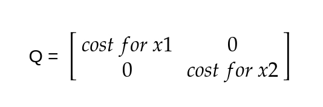
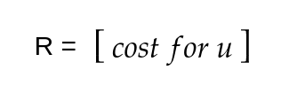
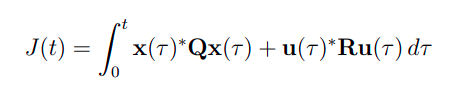

# LQR control

(No One shot videos for this :'(, you have to read through it or you may go through the MATLAB playlist linked at the references.:))

Well, in LQR we introduce two matrices. Q and R.

These are cost matrices which are the parameters that we tune. These act as control knob for controlling the system.

1. The Q matrice is a diagonal matrix of nxn which contains the cost of each variable of the state. The higher the cost, the quickly the system needs to converge to that particular variable.

2. The R matric is a 1xz matrix where z is the number of actuators in the system. It decides how much cost is associated with each actuator. The higher the cost of an actuator, the lest power it must use.

For example, let's say we have the following system- 

 

 <i></i> 

The Q and R matrices would look something like - 

 

 <i>Q matrix</i> 

 

 <i>R matrix</i> 

Now, we introduce a cost function that calculates the cost associated with the converges of the system and tries to minimise it. This cost is given as - 

 

 <i>LQR cost</i> 

(Quite heavy and scary to see ik :'( but do proceed you will soon understand it :))
Here, X and u are the state and actuator matrices at any time "tau" and the J is it's integration over a long time (equivalent to infinite amount of time).
What LQR does is it tries to produce a K matrix such that this J cost is minimum. This is an optimization problem and it's mathematics can't be covered here but modern control libraries in python and MATLAB can give you the K matrix with a single command, given you know values of A, B, Q and R.

**K = lqr(A, B, Q, R)**

Once we place the value of K into the dynamics, we get an optimal converging system which we can control and converge to any point that we like.

Well, that's all from our side for this week. Now you can also attempt the second task of the week. Best of Luck!!

 

 <i></i> 

Now the general question that may arise is:
# Why  LQR if we already have PID? 

The application of industrial robots has greatly increased in recent  years making production systems more and more efficient. With this in  mind, increasingly efficient controllers are needed for those robots. 

 

 <i></i> 

LQR control is a trade-off between highly optimized controls and reduced complexity such as in PID control.

LQR controllers are robust and produce a very low steady state error, However there are sometimes huge transition delays when working with multiple feedback gains, making them non-ideal to apply on fast response systems or those with no direct access to all states. On the other hand, a PID controller gives a faster response but not with robust gains as the previous controller. 

Also you can a give a read to this [Research paper](https://arxiv.org/pdf/2009.13175#:~:text=LQR%20is%20an%20optimal%20control%20regulator%20and%20is,test%20on%20the%20actual%20system%20requires%20its%20linearization.)(just give a overview reading to understand it better)

Therefore, which controller to use depends upon the system and operating conditions as well.

 

 <i>*le control Engineer</i> 

# Root of all systems, the Inverted Pendulum

#### Pendulums are Everywhere

*The inverted pendulum DOES represent many real-world systems*. Examples include the Segway, the human posture systems, the launching  of a rocket, and so on. Basically, any system that requires vertical  stabilization has dynamics that are similar to an inverted pendulum.  Sure, the dynamics in these real-world systems are more complex, but  they are related. The work involved in modeling and controlling an  inverted pendulum carries over to many engineering areas. [[reference link]](https://www.quanser.com/blog/why-is-the-pendulum-so-popular/)

Also the maths is easy .

## References

1. The series of videos by **MATLAB** will help to grasp the concept of PID in the best way possible. You can watch the entire playlist from [here](https://youtube.com/playlist?list=PLn8PRpmsu08podBgFw66-IavqU2SqPg_w&si=JZDF1TNWLjVr6HfM).

## Further Readings - Extras

1. Here is a great playlist on basics of control that covers all that has taken place in this camp yet in great detail. Watch this if you are really interested in controls and want to become a controls expert :)

