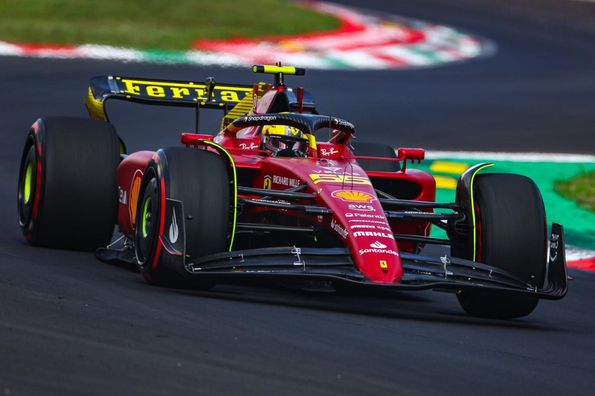

## Second task for the week

# Autonomous Car Challenge

 
 

 <i>Any FI fans here??(.....Carlos Sainz!!)</i>  

Enough learning and playing with the interfaces, Now it is your time to code!!!
We have prepared a sample file with a car loaded. It is loaded at some parallel distance with the line Y=0
The car needs to follow the line Y=0 marked with black color. 

Here is a reference video to help you with this task-
* [Controlling a self driving car](https://www.youtube.com/watch?v=4Y7zG48uHRo)

Here you can learn more about differntial drive if you don't know yet. Contact Organisers for hints if you still don't get it-
* [Differential Drive](https://www.societyofrobots.com/programming_differentialdrive.shtml)

# Goals for Weekly Challenge 1

1. Implement a Differential Drive based controller to drive the autonomous car around using Torque Control.
2. Develop a PID controller to make the car move on the straight line marked in simulation.
3. Callibrate the Gains to get the best performance and minimum turbulance.
4. Infer from the exercise how different error coefficients affect the performance and stability.

# INSTRUCTIONS -

1. Download this folder, along with the python code and src.
2. Execute the python code.
3. Press Escape key after selecting the track-bar window in order to start the simulation.
4. Press Escape again to reset it and run it again.

# Submission Link: https://forms.gle/5CXDGUZj2J6JH7jR7

# You did it

 
 

 <i>We are glad you made it till here.</i>  

 
 Once you have completed the challenge, we want you to submit the updated *line_follower.py* file on the link given below.
 
