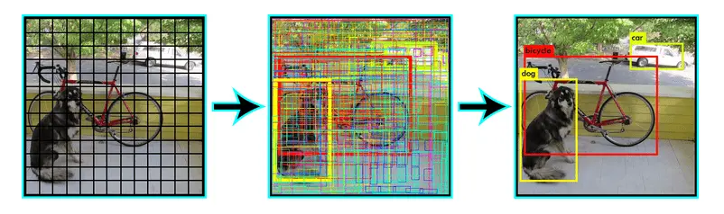

There are many object detection CNN architectures, and YOLO (You Only Look Once) is one of the most popular and efficient among them. We will provide you with resources to help you understand YOLO.

## Prerequisites Before Learning YOLO:

* Neural Networks
* Convolution Operations
* OOP (Object-Oriented Programming) in Python (for implementing YOLO)
* PyTorch

## Working of YOLO

    
   

YOLO is not very hard to understand, so we are referring you to one article and video that we believe will be sufficient for you to grasp how YOLO works.
#### Key Points to Keep in Mind While Going Through the Resources:
1. Different articles may use different grid divisions for the image. Don't worry; this just affects the maximum number of objects the YOLO architecture can predict. For example, if an architecture uses a 13x13 grid, it means it can detect a maximum of 169 objects in the image.
2.  Carefully understand the output generated by the architecture. Your understanding of this will determine how easily you can complete your final project.
3.  There are many versions of YOLO, ranging from v1 to v7, and some versions even have sub-releases. These versions usually have improved accuracy, but the methods they use are almost the same.

* ## [Medium Article](https://machinethink.net/blog/object-detection-with-yolo/)

* ### [Video Explanation ](https://www.youtube.com/watch?v=zgbPj4lSc58&t=1641s)

## YOLO implementation in PyTorch(if intrested)
https://colab.research.google.com/drive/1NdMWNZ8j4hFaLiNCfKm0N3GFLooyu1z5?usp=sharing

