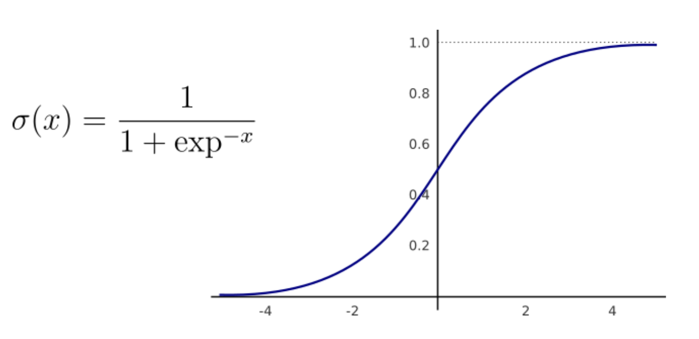
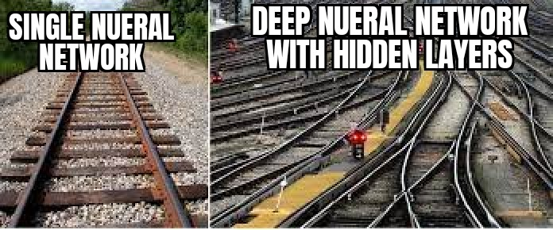

# Introduction to Neural Networks

Before we get into the implementation of Neural Network, let's first understand what a neural network is and how it actually operates

A neural network is a system or hardware that is designed to operate like a human brain.

Neural Networks are based on a collection of connected units (neurons), which, just like the synapses in a brain, can transmit a signal to other neurons, so that, acting like interconnected brain cells, they can learn and make decisions in a more human-like manner.

## How Neural Networks are used in Robotics

Neural networks are used in robots to enable them to perform complex tasks by processing the data gathered by sensors. Here are a few ways neural networks are utilized:

1. **Vision and Perception :** Neural networks can process visual data from cameras mounted on robots. They can recognize objects, people, and gestures, enabling robots to navigate autonomously, pick objects, or interact safely with humans.

2. **Speech Recognition and Natural Language Processing :** Neural networks can understand and respond to spoken commands or questions, allowing robots to interact verbally with humans in tasks like customer service or home assistance.

3. **Decision Making :** Neural networks can be trained to make decisions based on complex data inputs. This includes planning paths, prioritizing tasks, or reacting to unexpected changes in the environment.

4. **Sensor Fusion :** Neural networks can integrate data from multiple sensors (like cameras, lidar, or tactile sensors) to create a unified understanding of the robot's surroundings, enhancing situational awareness.

Overall, neural networks empower robots with cognitive abilities that allow them to perceive, reason, and act in ways that make them more versatile and effective in various applications, from industrial automation to household assistance and beyond.
## Structure of Neural Networks

A neural network is usually described as having different layers. The first layer is the input layer, it picks up the input signals and passes them to the next layer. The next layer does all kinds of calculations and feature extractions—it’s called the hidden layer. Often, there will be more than one hidden layer. And finally, there’s an output layer, which delivers the final result.

Therefore the 3 parts of a nueral network can be grouped as :-

  - **Input layer :** it has the job to pass the input vector to the Neural Network. If we have a matrix of 3 features (shape N x 3), this layer takes 3 numbers as the input and passes the same 3 numbers to the next layer.
  - **Hidden layer(s) :** they represent the intermediary nodes, they apply several transformations to the numbers in order to improve the accuracy of the final result, and the output is defined by the number of neurons. These layers are called 'hidden' since we never see their outputs directly.
  - **Output layer :** it returns the final output of the Neural Network. If we are doing a simple binary classification or regression, the output layer shall have only 1 neuron (so that it returns only 1 number). In the case of a multiclass classification with 5 different classes, the output layer shall have 5 neurons.

<details>
  <summary><h1>A single Neuron</h1></summary>

## The Linear Unit

So let's begin with the fundamental component of a neural network: the individual neuron. As a diagram, a neuron (or unit) with one input looks like:

<p align="center">
  
</p>
<br> 

The input is x. Its connection to the neuron has a weight which is w. Whenever a value flows through a connection, you multiply the value by the connection's weight. For the input x, what reaches the neuron is w * x.

The b is a special kind of weight we call the bias. The bias doesn't have any input data associated with it; instead, we put a 1 in the diagram so that the value that reaches the neuron is just b (since 1 * b = b). A neural network can 'learn' by adjusting the value of weights and biases.

The y is the value the neuron ultimately outputs. To get the output, the neuron sums up all the values it receives through its connections. This neuron's activation is y = wx + b
  
  ## Example: The Linear Unit as a model
  
  Let us try to compute the calories by consuming a product which has many ingredients like sugar, protien, etc. First we will only consider sugar
  
  Training a model with 'sugars' (grams of sugars per serving) as input and 'calories' (calories per serving) as output, we might find the bias is b=90 and the weight is w=2.5. We could estimate the calorie content of a cereal with 5 grams of sugar per serving like this:
  
  <p align="center">
  
</p>
<br> 
  
  And, checking against our formula, we have  calories=2.5×5+90=102.5 , just like we expect.
  
  ## Multiple Inputs
  
  Now the Product contain not just sugar but multiple ingredients. What if we wanted to expand our model to include things like fiber or protein content? That's easy enough. We can just add more input connections to the neuron, one for each additional feature. To find the output, we would multiply each input to its connection weight and then add them all together.
  
  <p align="center">
  
</p>
<br> 
  
  The formula for this neuron would be  y=w0x0+w1x1+w2x2+b . A linear unit with two inputs will fit a plane, and a unit with more inputs than that will fit a hyperplane.
  
  ## Linear Unit in Keras
  
  The easiest way to create a model in Keras is through keras.Sequential, which creates a neural network as a stack of layers. We can create models like those above using a dense layer (which we'll learn more about in the next lesson).

We could define a linear model accepting three input features ('sugars', 'fiber', and 'protein') and producing a single output ('calories') like so:
  
  ```python
  from tensorflow import keras
from tensorflow.keras import layers

# Create a network with 1 linear unit
model = keras.Sequential([
    layers.Dense(units=1, input_shape=[3])
])
  ```
  
  With the first argument, units, we define how many outputs we want. In this case we are just predicting 'calories', so we'll use units=1.

With the second argument, input_shape, we tell Keras the dimensions of the inputs. Setting input_shape=[3] ensures the model will accept three features as input ('sugars', 'fiber', and 'protein').

This model is now ready to be fit to training data!
  
</details>

<details>
  <summary><h1>Deep Neural Networks</h1></summary>

The term 'Deep' Learning is typically used when the model includes at least 2 hidden layers, amounting to a total of 4 layers when counting the input and output layers. Remember that all Deep Learning models are types of Neural Networks, but not all Neural Networks qualify as Deep Learning models.

  ## Layers 
  
  Neural networks typically organize their neurons into layers. When we collect together linear units having a common set of inputs we get a dense layer.
  
  <p align="center">
  
</p>
<br> 
  
  Think of each layer in a neural network as Performing a relatively simple transformation. Through a deep stack of multiple layers, a neural network can transform its inputs in more and more complex ways. In a well-trained neural network, each layer is a transformation getting us a little bit closer to a solution eventually bringing the network closer to the desired solution.
  
  ## The Activation Function 
  
  It turns out, Two dense layers back-to-back are essentially the same as one dense layer because they both perform linear transformations. Linear transformations only allow the network to create simple geometries like lines and planes. To model more complex patterns, non-linear elements are necessary,which is where **Activation Function** comes in.
  
  <p align="center">
  
</p>
<br> 
  
  An activation function is simply some function we apply to each of a layer's outputs (its activations). The most common is the rectifier function or ReLu. It is defined as max(0, x) i.e. if the output is > 0 than the answer will be x else it will be 0
  
  <p align="center">
  
</p>
<br> 
  
  The rectifier function has a graph that's a line with the negative part "rectified" to zero. Applying the function to the outputs of a neuron will put a bend in the data, moving us away from simple lines.

When we attach the rectifier to a linear unit, we get a rectified linear unit or ReLU. (For this reason, it's common to call the rectifier function the "ReLU function".) Applying a ReLU activation to a linear unit means the output becomes max(0, w * x + b), which we might draw in a diagram like:
  
  <p align="center">
  
</p>
<br> 
  
  

  
  ## Stacking Dense layers
  
  Now that we have some nonlinearity, let's see how we can stack layers to get complex data transformations.

  <p align="center">
  
</p>
<br> 

Here the final (output) layer is a linear unit (meaning, no activation function). That makes this network appropriate to a regression task, where we are trying to predict some arbitrary numeric value. Other tasks (like classification) might require an activation function on the output.

The most common function used for binary classification is sigmoid. It is defined as σ(x) = 1/(1+exp(-x))
  
   <p align="center">
  
</p>
<br>

The sigmoid function is a mathematical S-shaped curve that squashes any real number into a value between 0 and 1. It's like a dimmer switch, taking a wide range of inputs and turning them into outputs suitable for representing probabilities (0 for unlikely, 1 for certain)

  
  <p align="center">
  
</p>
<br> 

## Building Sequential Models
  
The Sequential model we've been using will connect together a list of layers in order from first to last: the first layer gets the input, the last layer produces the output. This creates the model in the figure above:
  
  ```python
  from tensorflow import keras
from tensorflow.keras import layers

model = keras.Sequential([
    # the hidden ReLU layers
    layers.Dense(units=4, activation='relu', input_shape=[2]),
    layers.Dense(units=3, activation='relu'),
    # the linear output layer 
    layers.Dense(units=1),
])
  ```
  
  You Can use the above model to train any data 

</details>