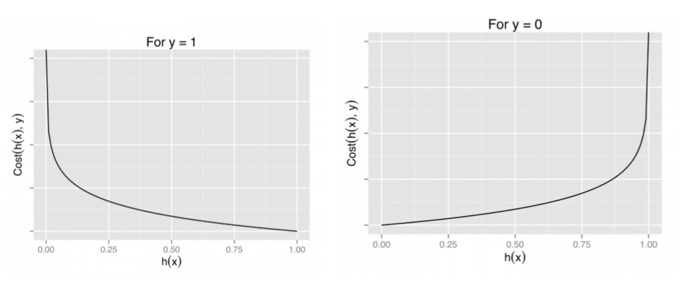
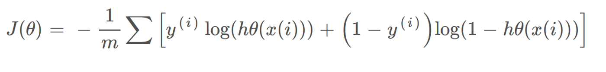
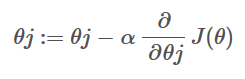

# Optimization

Till now, we learned how to build fully-connected networks out of stacks of dense layers. When first created, all of the network's weights and biases are set randomly -- the network doesn't "know" anything yet.

now we begin with a set of training data. Each example in the training data consists of some features (the inputs) together with an expected target (the output).Training the network means adjusting its weights and biases in such a way that it can transform the features as close as possible to the targets'.If successfully trained, the weights and biases can represent in some way the relationship between those features and that target as expressed in the training data.

In addition to the training data, we need two more things:

- A "loss function" that measures how good the network's predictions are.
- An "optimizer" that can tell the network how to change its weights.


## The Loss Function
  
We've seen how to design an architecture for a network, but we haven't seen how to tell a network what problem to solve. This is the job of the loss function.

The loss function(also called cost function) measures the disparity between the the target's true value and the value the model predicts.

Different problems call for different loss functions.We have been looking at regression problems, where the task is to predict some numerical value -- such as the price of a house or the fuel efficiency of a car.

A common loss function for regression problems is the mean absolute error or MAE. For each prediction y_pred, MAE measures the disparity from the true target y_true by an absolute difference abs(y_true - y_pred).

The total MAE loss on a dataset is the mean of all these absolute differences.
  
  


A graph depicting error bars from data points to the fitted line..
The mean absolute error is the average length between the fitted curve and the data points.
Besides MAE, other loss functions you might see for regression problems are the mean-squared error (MSE) or the Huber loss (both available in Keras).

The loss function(or cost function) used for binary classification problems is binary cross entropy.It is defined as follows - 

−log(hθ(x)) if y = 1

−log(1−hθ(x)) if y = 0

<p align="center">

</p>
These two Function can be shown as
<br><br>
<p align="center">

</p>

The above two functions can be compressed into a single function i.e.
<br><br>
<p align="center">

</p>

During training, the model will try to minimize the cost function by adjusting it's weights and biases.In other words, the loss function tells the network its objective.


## Stochastic Gradient Descent

by adjusting weights and biases(or parameters) our neural network can minimize the loss function. But how do we know which adjustments to make? which parameters will have the most effect on loss function?

for a given training data,adjusting parameters can change the output of loss function. **The cost function(denoted as J(θ)) is a function with input as parameters(θ) and output as the loss.**

Now all we have to do is to calculate the **Derivative(or Gradient) of loss function w.r.t. each parameter and subtract it from each parameter multiplied by a learning rate(α).**

<br><br>
<p align="center">

</p>

this process will be repeated until we reach the minimum of cost function

<br><br>
<p align="center">

</p>

The process of updating parameters based on gradient has a special name and it is called **Stochastic Gradient Descent or SGD** 

One step of training goes like this:
  
   - Sample some training data(a batch) and run it through the network to make predictions.
   - Measure the loss between the predictions and the true values.
   - Finally, adjust the weights in a direction that makes the loss smaller.

## Learning Rate and Batch Size
  
The size of each 'step' is determined by the learning rate(α).A smaller learning rate means the network needs to see more minibatches before its weights converge to their best values.

Each iteration's sample of training data is called a minibatch (or often just "batch"), while a complete round of the training data is called an epoch. The number of epochs you train for is how many times the network will see each training example

The learning rate and the size of the minibatches are the two parameters that have the largest effect on how the SGD training proceeds. Their interaction is often subtle and the right choice for these parameters isn't always obvious.

Fortunately, for most work it won't be necessary to do an extensive hyperparameter search to get satisfactory results. **Adam is an SGD algorithm that has an adaptive learning rate that makes it suitable for most problems without any parameter tuning (it is "self tuning", in a sense). Adam is a great general-purpose optimizer.**

  ## Adding the Loss and Optimizer
  
After defining a model, you can add a loss function and optimizer with the model's compile method:
  
  ```python
  model.compile(
    optimizer="adam",
    loss="mae",
)
  ```
  
  Notice that we are able to specify the loss and optimizer with just a string. You can also access these directly through the Keras API -- if you wanted to tune parameters, for instance -- but for us, the defaults will work fine.
  
  ## Example - Red Wine Quality
  
Now we know everything we need to start training deep learning models. So let's see it in action! We'll use the Red Wine Quality dataset.

This dataset consists of physiochemical measurements from about 1600 Portuguese red wines. Also included is a quality rating for each wine from blind taste-tests. How well can we predict a wine's perceived quality from these measurements?

We've put all of the data preparation into this next hidden cell. It's not essential to what follows so feel free to skip it. One thing you might note for now though is that we've rescaled each feature to lie in the interval  [0,1] .Neural Networks tend to perform best when their inputs are on a common scale.
  
  ```python
  import pandas as pd
from IPython.display import display

red_wine = pd.read_csv('../input/dl-course-data/red-wine.csv')

# Create training and validation splits
df_train = red_wine.sample(frac=0.7, random_state=0)
df_valid = red_wine.drop(df_train.index)
display(df_train.head(4))

# Scale to [0, 1]
max_ = df_train.max(axis=0)
min_ = df_train.min(axis=0)
df_train = (df_train - min_) / (max_ - min_)
df_valid = (df_valid - min_) / (max_ - min_)

# Split features and target
X_train = df_train.drop('quality', axis=1)
X_valid = df_valid.drop('quality', axis=1)
y_train = df_train['quality']
y_valid = df_valid['quality']
  ```
  
  How many inputs should this network have? We can discover this by looking at the number of columns in the data matrix. Be sure not to include the target ('quality') here -- only the input features
  
  ```python
  print(X_train.shape)
  ```
  
  you will see the output (1119, 11)
  
  Eleven columns means eleven inputs.

We've chosen a three-layer network with over 1500 neurons. This network should be capable of learning fairly complex relationships in the data.
  
  ```python
  from tensorflow import keras
from tensorflow.keras import layers

model = keras.Sequential([
    layers.Dense(512, activation='relu', input_shape=[11]),
    layers.Dense(512, activation='relu'),
    layers.Dense(512, activation='relu'),
    layers.Dense(1),
])
  ```
  
  Deciding the architecture of your model should be part of a process. Start simple and use the validation loss as your guide. You'll learn more about model development in the exercises.

After defining the model, we compile in the optimizer and loss function.

```python
  model.compile(
    optimizer='adam',
    loss='mae',
)
  ```
  
Now we're ready to start the training! We've told Keras to feed the optimizer 256 rows of the training data at a time (the batch_size) and to do that 10 times all the way through the dataset (the epochs).

  ```python
history = model.fit(
    X_train, y_train,
    validation_data=(X_valid, y_valid),
    batch_size=256,
    epochs=10,
)
  ```
  
  You can see that Keras will keep you updated on the loss as the model trains.

Often, a better way to view the loss though is to plot it. The fit method in fact keeps a record of the loss produced during training in a History object. We'll convert the data to a Pandas dataframe, which makes the plotting easy.
  
  ```python
  import pandas as pd

# convert the training history to a dataframe
history_df = pd.DataFrame(history.history)
# use Pandas native plot method
history_df['loss'].plot()
  ```
  
  

  Notice how the loss levels off as the epochs go by. When the loss curve becomes horizontal like that, it means the model has learned all it can and there would be no reason continue for additional epochs.

  ## Additional content

  you can check out this tutorial on [3B1B](https://www.youtube.com/playlist?list=PLZHQObOWTQDNU6R1_67000Dx_ZCJB-3pi) for neural network(Only till 4th video)